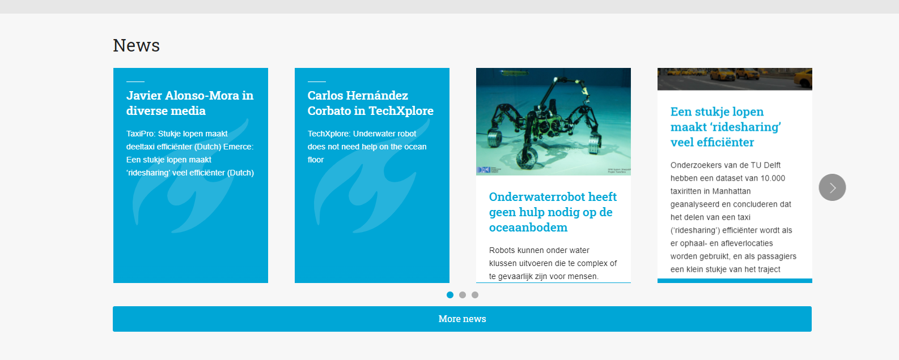

# 内容

视频文章等信息等到服务器可以联通之后再做整理，或者明后天做好了网站之后，去一趟学校填充。

## Research Tag

分类可以通过设置 Categories 变量的方式来进行。

在这里做一个目录，分成几类。

小类中按照时间进行排序。

## 主页

- [ ] 主页中，从上到下，每一栏最好制定不同的背景颜色作为区分
    > 可参考一下主页中的strip布局，这个的背景颜色就是灰色的

## News
在News里，把所有的文章按时间顺序排取前10个，这里不包括论文Research 介绍。

找一个合适的显示post的放在主页

这个delft的格式挺好的

 

我需要找一个 bootstrap 的卡片样式，并且能给jeykyll使用的。

## People

People中也做一个标签导航，老师-博士-研究生-本科生--毕业的人员

数据模型 
    
    姓名：
    照片：
    年纪：
    联系方式：
    自己的介绍：

这里需要设计一个总体的页面，然后再设计一个个人页面

---
## R-Markdown

用处不大，主要是用于交互式的。。。 通过数据生成的图片用matlab变成png来导入md也是一样的。

看到其他人使用 [R-Markdown](https://rmarkdown.rstudio.com/lesson-1.html)来写文章，然后生成md 和 html的版本，再导入到jekyll中，看起来会更灵活一些，试试看这个怎么样。

1. 下载 [R语言](https://www.r-project.org/)
    

2. 然后下载 [R-Studio](https://www.rstudio.com/products/rstudio/download/#download)

3. 安装 [R-Markdown](https://rmarkdown.rstudio.com/lesson-1.html)

    `install.packages("rmarkdown")`

---
## To Do List

- [x] 添加百度统计
- [x] 使用图片服务器
- [ ] 布置主页
- [ ] 添加一个新闻页面版式
- [ ] 在Contact中加入地图
- [ ] 对Team建一个数据模型

## 字体？

1. [字由](https://www.hellofont.cn/)

    需要下载客户端，然后再部署字体。  
2. [猫啃](https://www.maoken.com/)
    
    一个字体包要4、50M啊，这个咋可能放在服务器上。还是先不考虑字体了。