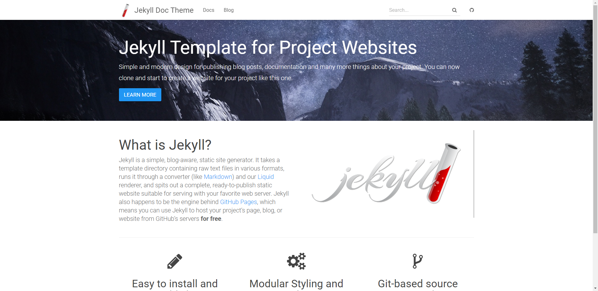
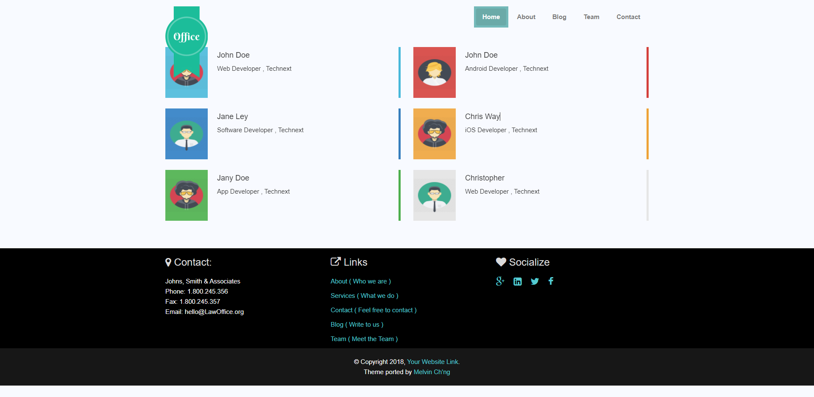
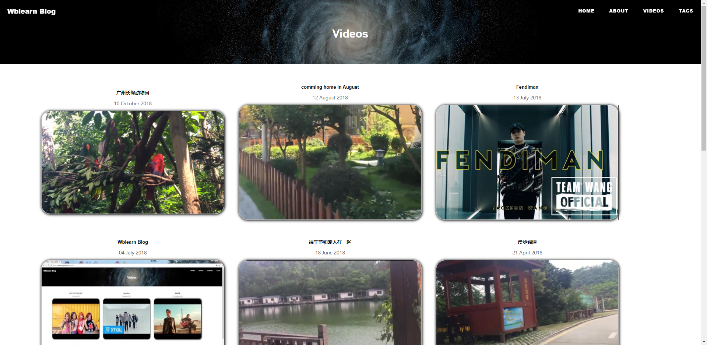
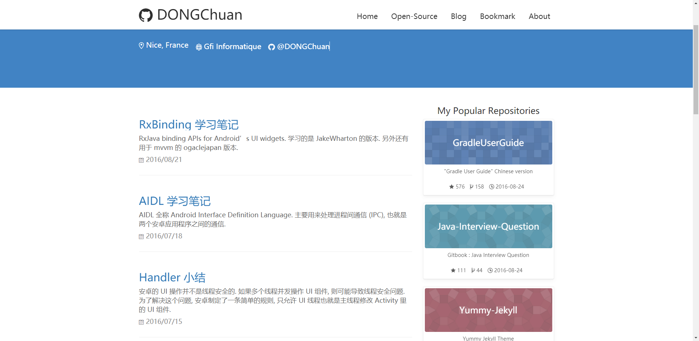
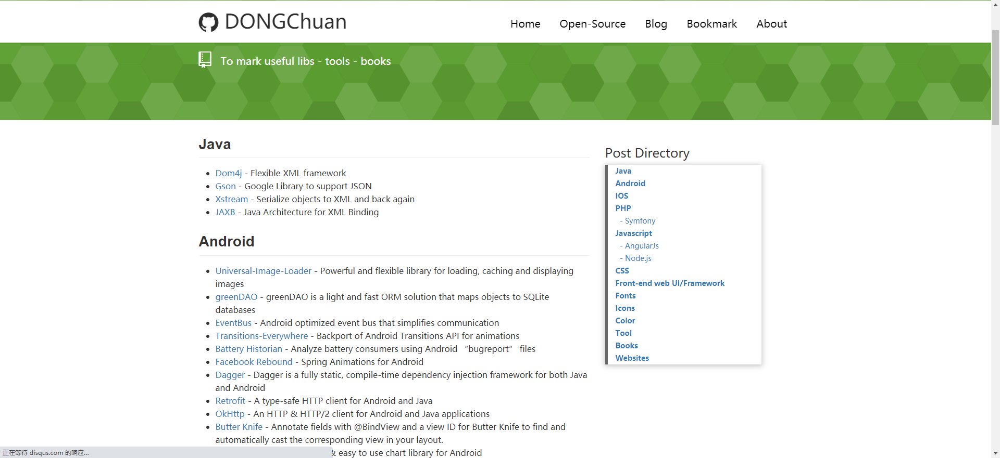
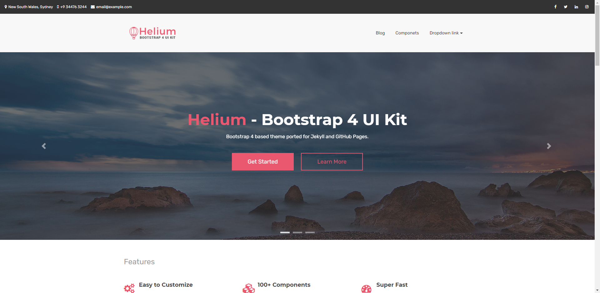
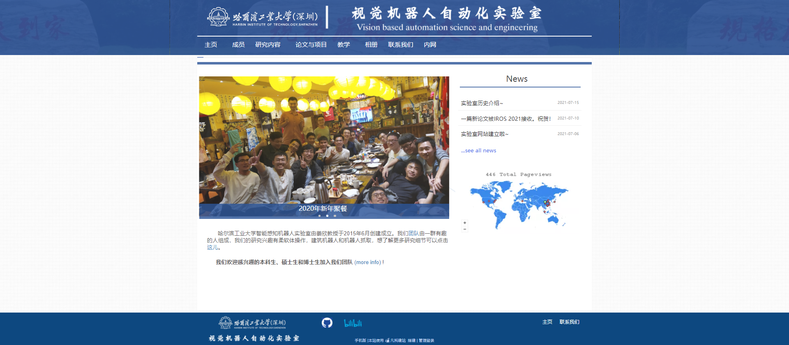

## 1. Install

1. [安装Ruby](http://www.ruby-lang.org/en/downloads/)

2. [安装NodeJs](https://nodejs.org/en/)

3. 安装Jekyll
   
   `gem install jekyll`

## 2. 启动

1. 在工作空间中

   `jekyll create myblog`

    创建一个jekyll的工程，这个和vue挺像的

2. 运行

    `gem serve`

3. 在浏览器输入 `localhost:4000` 就可以访问初始页面。

## 3. 各种主题

1. [Jekyll Doc](https://aksakalli.github.io/jekyll-doc-theme/)
    
    > 这个有个问题,因为依赖的事情，新版的Ruby他不支持。

    这个主题主页挺好看的，挺简洁，但是少了一个news的地方，可以看看怎么放上去。另外这个还包含了一个文档展示的页面。

    
2. [Business](https://business-jekyll-theme.github.io/team.html)

    这个主题有一个Team的卡片化挺好看的，可以借鉴一下，主页有点浮夸了，而且左上方的logo很碍事。

    

3. [Weblearn](https://wblearn.top/)

    有嵌入式视频和嵌入式的评论区，挺好的。但是主页不好看。可以借鉴一下视频

    

    评论区功能可以使用[来必力](http://livere.com/)
    
4. [Yummy Theme](http://dongchuan.github.io/)

    这个主页有侧边栏，可以参考一下

    

    这个目录挺好的，可以拿过来用

    

5. [Soot Spirits](https://sootspirits.github.io/)

    这个主页挺整洁的，还有搜索功能。

    
    
6. [Helium](https://heliumjk.github.io/)

    哇塞，突然好喜欢这个，bootstrap的，还给留出了各个component的接口

    起码这里有card的样式了，可以让我放放news
   
   

7. [师妹设计的样式](https://wc25655342.jzfkw.cn/col.jsp?id=105) 

    

    挺好看的，整整齐齐的。这个banner挺好的，下面的会不会太简单了点。
8. 

## 主页

我需要一个视频。 我来拍一下并制作一下吧。

随便搞了一个Logo 

### 标题叫什么好呢

1. Intelligent Perception Robotic Lab

## 图片

图片服务器 [又拍云](https://console.upyun.com/services/jx-webserver/filemanage/)

